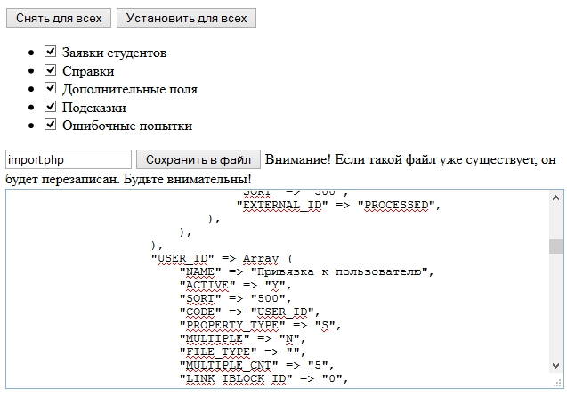

BitrixMigration 2.0
===============
Скрипт позволяет экспортировать структуру, элементы и разделы инфоблоков в массив для дальнейшего импорта.

Пример кода сгенерированного файла можете посмотреть в файле [example.php](example.php)

## Интерфейс

